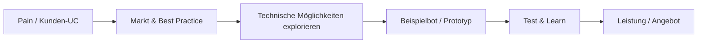

# AI in Applikationen — Use Cases

Sammlung aus Gesprächen und Kundenkontext: **Schwerpunkt Use Case statt Technologie** — zuerst Pain und Nutzen, dann Lösung skizzieren.

---

## Leitgedanke

| Prinzip | Bedeutung |
|---------|-----------|
| **Use Case vor Tech** | Nicht mit Modell oder Stack starten, sondern mit Kundenproblem |
| **Pain → Lösung** | Welchen Pain haben unsere Kunden? Dann Lösungen skizzieren |
| **Referenzen als Inspiration** | Marktbeispiele (z. B. Check24) dienen der Einordnung, nicht der 1:1-Kopie |
| **Weitergabe** | Reife Ideen gezielt an Vertrieb oder Umsetzung übergeben |

---

## Typische Use Cases von Kunden

| Bereich | Beispiel | Notiz |
|---------|----------|--------|
| **Chatbots** | Support, FAQ, Produktberatung | Häufigster Einstieg — siehe UC unten |
| **DX / UX-Prozesse** | KI in Design- und Entwicklungsabläufen | Verknüpfung mit [UX Prozess-Beratung](02-ux-prozess-beratung.md) |

---

## Best Practice am Markt

### Check24 — Recherche & Orientierung

**Beobachtung:** Such- und Beratungserlebnis mit KI-Elementen — Referenz für „Mit der Suchfunktion chatten“.

**Relevanz für uns:**

- Wie wird Recherche in Conversational UI übersetzt?
- Was können wir für Kunden-UCs ableiten (nicht kopieren)?

**Status:** Recherche | **Nächster Schritt:** Konkrete Screens/Flows dokumentieren, Pain vs. Lösung gegen unsere Kunden ableiten

*Stand: 2026-06-12 — Gespräch & Impuls MZ*

---

## Use Cases (Sammlung)

### UC-01: Chatbot mit KI — Kundenberatung

**Kontext:** Kunde möchte Nutzer:innen bei Produkt- oder Servicefragen unterstützen.  
**Problem (Pain):** Statische FAQ reicht nicht; Support skaliert schlecht.  
**AI-Lösung:** Conversational Bot auf Basis von Wissensbestand — Antworten, Nachfragen, ggf. Übergabe an Mensch.  
**Variante:** Mit der **Suchfunktion chatten** statt klassischer Suche.  
**Nächste Schritte:** Recherche vertiefen (Check24 u. a.) · Idee an **Vertrieb** zur Kundenansprache  
**Status:** Idee

*Stand: 2026-06-12*

---

### UC-02: Beispielbots konzipieren und bauen

**Kontext:** Interne oder Demo-Anwendung zum Testen von UC-Hypothesen.  
**Problem:** Use Cases bleiben abstrakt, ohne erlebbaren Prototyp.  
**AI-Lösung:** Schlanke Beispielbots bauen, um UX, Tonality und Grenzen zu verproben.  
**Status:** Idee — **technische Möglichkeiten explorieren**

*Stand: 2026-06-12*

---

### UC-03: Mobile AI als Support für Desktop-Anwendung

**Kontext:** Nutzer:in arbeitet primär am Desktop, braucht unterwegs Ergänzung.  
**Problem:** Desktop-Workflow bricht auf Mobile ab; kein nahtloser Zugriff auf Kontext.  
**AI-Lösung:** Mobile AI-Begleiter — z. B. Status, Kurzabfragen, Spracheingabe für Aufgaben aus der Desktop-App.  
**Status:** Idee

*Stand: 2026-06-12*

---

### UC-04: Sprache + visuelle Interaktion über Endgeräte hinweg

**Kontext:** Wechsel zwischen Desktop, Tablet, Smartphone im selben Flow.  
**Problem:** Unterschiedliche Eingabearten (Tippen vs. Sprechen) und Displaygrößen werden nicht konsistent bedacht.  
**AI-Lösung:** Kombination aus **Sprach-** und **visueller** Interaktion — kontextabhängig je Endgerät, ein gemeinsamer Nutzer-Flow.  
**Status:** Idee — explorieren

*Stand: 2026-06-12*

---

## Exploration & Umsetzungspfad



| Phase | Aktivität |
|-------|-----------|
| **Verstehen** | Pain der Kunden, typische UCs (Chatbot, DX/UX) |
| **Einordnen** | Best Practice (z. B. Check24) |
| **Explorieren** | Technische Möglichkeiten, Tools, Grenzen |
| **Testen** | Beispielbots konzipieren und bauen |
| **Skalieren** | Leistungen entwickeln (siehe Prozess-Beratung) |

---

## Leistungen rund um Use Cases

Diese Themen hängen eng mit [UX Prozess-Beratung](02-ux-prozess-beratung.md) zusammen:

- Workshops
- Checklisten
- Konzeption
- Flow Design
- Beratung zu Chatbots und KI in Applikationen

---

## Vorlage für neue Use Cases

```markdown
### UC-XX: [Kurztitel]

**Kontext:** …
**Problem (Pain):** …
**AI-Lösung:** …
**Nächste Schritte:** …
**Status:** Idee | In Prüfung | An Vertrieb | Umgesetzt

*Stand: YYYY-MM-DD — Initialen*
```

---

## Offen

- [ ] Check24-Recherche dokumentieren (Screens, Flow, Learnings)
- [ ] Ersten Beispielbot definieren (Scope, Zielgruppe)
- [ ] UC-01 für Vertriebsgespräch aufbereiten
- [ ] Mobile + Multi-Device-UC mit konkretem Kundenpain verknüpfen

---

*Stand: 2026-06-12 — aus Team-Gespräch & Impuls MZ*
