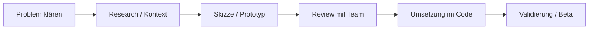

# UX Prozess-Beratung

Methoden, Checklisten und Entscheidungsvorlagen für UX-Arbeit im Team — von der Idee bis zum Review.

---

## Prozess-Überblick

---

## Review-Checkliste (kurz)

Vor jedem größeren UI-Release:

- [ ] **Zielgruppe klar?** (Eltern vs. Rookie vs. beide)
- [ ] **Happy Path** in unter 3 Klicks erreichbar?
- [ ] **Fehlerzustände** beschriftet (nicht nur „Error“)?
- [ ] **Mobile** getestet (375px Breite)?
- [ ] **Barrierefreiheit:** Kontrast, Fokus, Tastatur?
- [ ] **Copy** auf Deutsch konsistent (Du/Sie-Regel)?
- [ ] **Leerzustände** mit Handlungsaufforderung?

---

## Workshop-Formate

### 15-Minuten UX-Flash

1. Screenshot / Link zeigen (2 Min)
2. „Was funktioniert / was stört?“ — jede:r 1 Punkt (8 Min)
3. Eine konkrete nächste Aktion (5 Min)

### CDD-Session (30 Min)

1. `was-ist-neu.md` durchgehen (5 Min)
2. Einen Navigationspunkt vertiefen (20 Min)
3. Changelog + Commit (5 Min)

---

## Entscheidungsvorlage

| Frage | Option A | Option B | Entscheidung | Datum |
|-------|----------|----------|--------------|-------|
| *Beispiel: Onboarding-Schritte* | 6 Schritte beibehalten | auf 4 reduzieren | offen | — |

---

## Beratungs-Anfragen (Backlog)

| Thema | Anfragende:r | Status |
|-------|----------------|--------|
| Eltern-Dashboard Informationsdichte | — | offen |
| Rookie-Challenge-Flow Vereinfachung | — | offen |

---

## Offen

- Feste Review-Termine (z. B. monatlich)?
- Figma als Design-Source-of-Truth verlinken?

---

*Stand: 2026-06-12*
